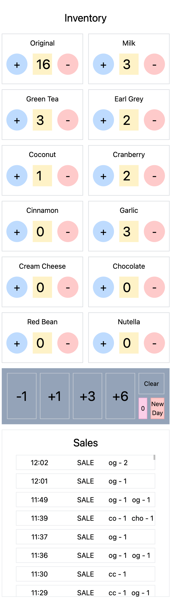
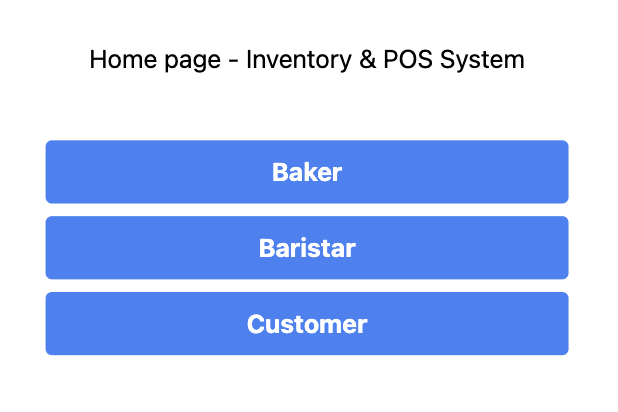
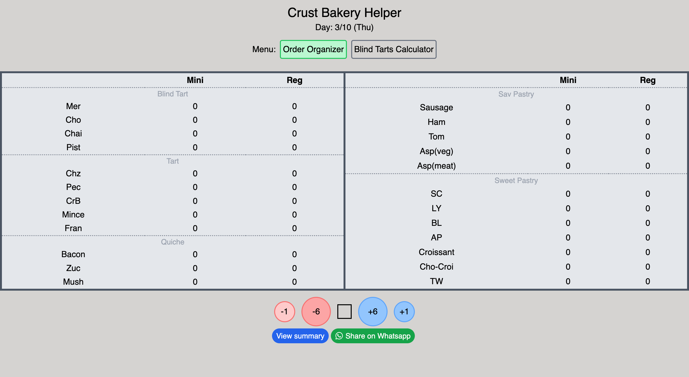
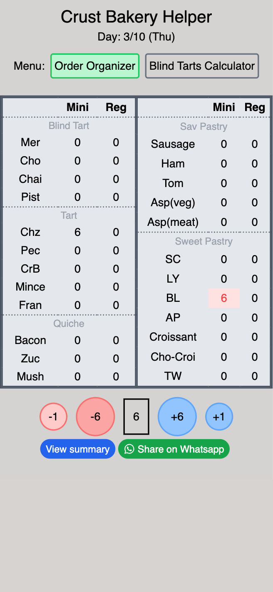

# Bakery Management Suite

A comprehensive suite of tools for bakery operations management, combining inventory control, POS integration, and production calculators.

## Applications

### Inventory & POS System
The Inventory & POS system integrates with Loyverse POS to provide:
- Real-time inventory tracking
- Customer-facing display
- Daily production planning
- Sales reporting

**Technologies:** React, Firebase, Loyverse API

[View Repository](https://github.com/DuLoops/Bakery_POS_inventory_customerScreen)

### Production Calculator

The Recipe Calculator helps bakery staff:
- Calculate blind baked tart quantities
- Plan daily production volumes
- Optimize ingredient usage
- Schedule production tasks

**Technologies:** React + TypeScript + Vite

[View Repository](https://github.com/DuLoops/CrustBakery_Calculator)

## Development Story

These applications were developed for real-world bakery operations to solve specific business challenges:

1. **Inventory Management Problem:**
   The bakery struggled with inventory tracking across multiple product categories. This solution provides real-time inventory visibility integrated with the Loyverse POS system.

2. **Production Planning Challenges:**
   Staff needed better tools to forecast daily production needs for tarts and other baked goods. The calculator application streamlines this process and reduces waste.

## Architecture

The suite consists of two complementary applications that can work independently or together:

```
Bakery Management Suite
├── Inventory & POS System
│   ├── React Frontend
│   ├── Firebase Database
│   ├── Loyverse API Integration
│   └── Customer Display Screen
└── Recipe Calculator
    ├── React/TypeScript App
    ├── Vite Build System
    └── Production Planning Tools
```

## Installation & Setup

### Inventory System
```bash
git clone https://github.com/DuLoops/Bakery_POS_inventory_customerScreen.git
cd Bakery_POS_inventory_customerScreen
npm install
npm start
```

### Calculator App
```bash
git clone https://github.com/DuLoops/CrustBakery_Calculator.git
cd CrustBakery_Calculator
npm install
npm run dev
```

## Technologies

This suite leverages modern web technologies including:
- React & React Hooks
- TypeScript
- Firebase Realtime Database
- Loyverse POS API Integration
- Vite Build System

## Scrennshots

### Inventory & POS System

*Comprehensive inventory management dashboard for tracking bakery supplies and product levels*


*Landing page of the inventory management system with key metrics at a glance*

### Production Calculator


*Desktop view of the Recipe Calculator application showing production planning interface*


*Mobile-responsive view of the Recipe Calculator for use on tablets and phones in the kitchen*


